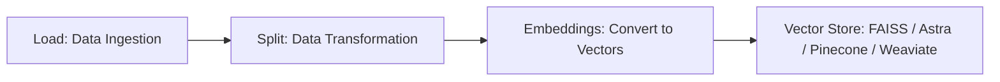
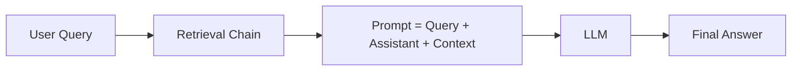

# Generative AI

## 1. What is Generative AI?

Generative AI (GenAI) is a branch of artificial intelligence that focuses on creating new, original content. Instead of just analyzing or predicting outcomes, it **generates text, images, music, video, or even code**.

* Example:

  * ChatGPT → generates human-like text.
  * MidJourney/DALL·E → generates images.
  * GitHub Copilot → generates code.

The key strength of GenAI is its ability to **learn from vast datasets** and then produce creative outputs that mimic human intelligence.

---

## 2. AI vs ML vs DL vs Generative AI

| Term                             | Meaning                                                                              | Example                               |
| -------------------------------- | ------------------------------------------------------------------------------------ | ------------------------------------- |
| **AI (Artificial Intelligence)** | The broad field of machines simulating human intelligence.                           | Self-driving cars, chess-playing bots |
| **ML (Machine Learning)**        | Subset of AI where systems **learn from data** and improve over time.                | Spam email filter                     |
| **DL (Deep Learning)**           | Subset of ML using **neural networks with multiple layers** to process complex data. | Face recognition, speech-to-text      |
| **Generative AI**                | Subset of DL/ML where models create **new data/content** based on what they learned. | ChatGPT (text), DALL·E (images)       |

👉 Think of it as:
**AI** = Big umbrella  
**ML** = Learning from data  
**DL** = Complex ML with deep neural networks  
**Generative AI** = AI that *creates*

---

## 3. How OpenAI ChatGPT & LLaMA 3 LLM Models are Trained

Large Language Models (LLMs) like **ChatGPT (OpenAI)** or **LLaMA 3 (Meta)** follow a multi-step training process:

1. **Pretraining**
   * The model is fed with massive amounts of raw text data (books, articles, websites, code).
   * Goal: Learn grammar, facts, and reasoning.
   * Technique: **Self-supervised learning** (predict the next word in a sentence).

2. **Fine-tuning**
   * Model is further trained on high-quality, domain-specific data.
   * Helps adapt the model for real-world applications.

3. **RLHF (Reinforcement Learning with Human Feedback)**
   * Human reviewers rank model responses.
   * AI learns what’s *helpful, safe, and human-like*.

4. **Deployment**
   * Optimized for speed, scalability, and efficiency (through quantization, distributed GPUs, etc.).

👉 Difference between **ChatGPT & LLaMA 3**:
* ChatGPT → Trained on massive private datasets, optimized for conversation.  
* LLaMA 3 → Open-source model, lighter but highly efficient, designed for research & customization.

---

## 4. Evolution of LLM Models

* **2017** → Introduction of *Transformers* (Google’s “Attention is All You Need”).
* **2018** → BERT (Bidirectional Encoder Representations from Transformers) → focused on understanding.
* **2020** → GPT-3 → true generative power with 175B parameters.
* **2022** → ChatGPT (GPT-3.5) → made conversational AI mainstream.
* **2023** → GPT-4, LLaMA 2, Claude, PaLM → more efficient, safer, multimodal.
* **2024–2025** → LLaMA 3, GPT-4.1/5, Gemini, Mistral → smaller, faster, open-source models dominating research & industry.

👉 Trend: Models are becoming **smarter, safer, multimodal (text+image+audio), and more open-source**.

---

## 5. All LLM Models – Analysis

(Reference: [artificialanalysis.ai](https://artificialanalysis.ai/))

| Model                    | Developer       | Strengths                                      | Use Case                        |
| ------------------------ | --------------- | ---------------------------------------------- | ------------------------------- |
| **GPT-4/ChatGPT**        | OpenAI          | Best reasoning, creative writing, coding       | Business, research, education   |
| **LLaMA 3**              | Meta            | Open-source, lightweight, fine-tuning friendly | Research, startups, custom apps |
| **Claude**               | Anthropic       | Strong safety & long context window            | Enterprises, compliance         |
| **Gemini (Google)**      | Google DeepMind | Multimodal (text + image + video)              | Search, content, enterprise     |
| **Mistral / Mixtral**    | Mistral AI      | Efficient, small models with high performance  | On-device AI, startups          |
| **Grok (xAI/Elon Musk)** | xAI             | Integrated with X (Twitter)                    | Social + conversational AI      |

---

## 6. LangChain

LangChain is an **open-source framework** designed to simplify the development of applications powered by Large Language Models (LLMs). Instead of directly calling LLM APIs, LangChain provides structured tools to:
- Connect LLMs with databases and external APIs.
- Chain multiple components like prompts, memory, and logic together.
- Build advanced GenAI apps such as RAGs, chatbots, and AI agents.

### Why LangChain?

1. **Abstraction & Modularity** – Provides pre-built modules for prompts, chains, memory, and agents.  
2. **Integration-Friendly** – Works seamlessly with vector DBs (Pinecone, Weaviate, FAISS), LLM providers (OpenAI, Anthropic, Hugging Face, Ollama), and APIs.  
3. **Scalability** – Move easily from prototype to production.  
4. **Rapid Prototyping** – Reduces boilerplate code.  
5. **Ecosystem Support** – Backed by strong community adoption and plug-ins.

### LangChain Ecosystem

1. **LangChain Core** – Prompt templates, chains, agents, memory.  
2. **LangChain Integrations** – LLMs, vector stores (Pinecone, FAISS, Milvus, Chroma), databases & APIs.  
3. **LangSmith (Observability)** – Debugging, monitoring, evaluation.  
4. **LangServe (Deployment)** – Turn LangChain apps into APIs.  
5. **LangGraph** – Graph-based workflows, ideal for multi-agent systems.

### Why LangChain is Important

1. **Connects LLMs with External Data** – Enables **Retrieval-Augmented Generation (RAG)**.  
2. **Adds Memory** – For contextual, human-like conversations.  
3. **Supports Complex Workflows** – Automates reasoning with Chains & Agents.  
4. **Tool Usage & Agentic Behavior** – Lets LLMs act as agents using calculators, SQL, APIs, etc.  
5. **Production-Readiness** – Monitor & scale apps with LangSmith + LangServe.  
6. **Ecosystem & Community Support** – Widely adopted across industries.

---

## 7. Retrieval-Augmented Generation (RAG)

RAG is a method to enhance LLMs with **external knowledge** by combining information retrieval with generation.

### RAG Flow

#### 1. **Data Preparation Pipeline**

- **Load:** Ingest data (PDFs, CSVs, APIs) using LangChain.  
- **Split:** Break data into chunks due to LLM context limits. Methods → Recursive Split, Character Split, HTML Split, JSON Split.  
- **Embeddings:** Convert text chunks into vectors (OpenAI, Hugging Face, Ollama).  
- **Vector Stores:** Save embeddings in FAISS, Astra, Chroma, Weaviate, Pinecone.  

#### 2. **Question Answering Pipeline**

- **Query:** User input.  
- **Retrieval Chain:** Fetches relevant chunks from the vector DB.  
- **Prompt Construction:** Combines query + assistant instructions + context.  
- **LLM:** Processes enriched prompt.  
- **Answer:** Returns accurate, context-aware response.  

